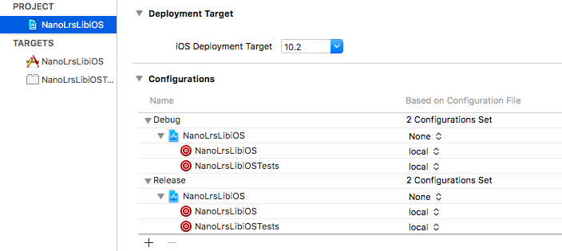

NanoLrs for iOS

The port is based on j2objc and SharkORM.  To use use:

1. Run the code generator to translate java code and generate SharkORM entity classes:

'''
$ ./generate.sh
'''

2. Include Generated/*  

Project setup notes:

This is only needed if you want to develop NanoLrs for iOS itself: if not you can simply include the generated sources in your own xcode project.

Project setup is done largely as per http://j2objc.org/docs/Xcode-Build-Rules.html .  

* Create a new XCode project using the Single View Application template
* Create a new config file in the project, saved to the projects root directory, called local.xcconfig .
* J2OBJC_HOME=/path/to/objc is put into local.xcconfig. The configuration is then applied by selecting the project from the left, selecting the project itself (not individual targets), and then choosing the configuration file itself . This should result in something like: 

